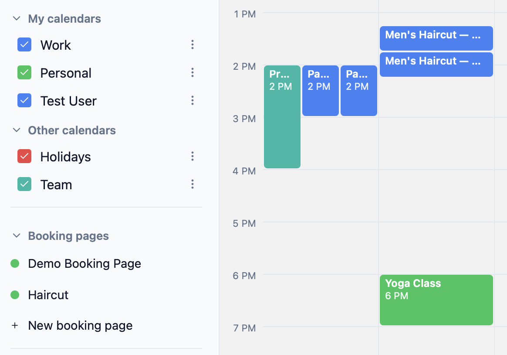
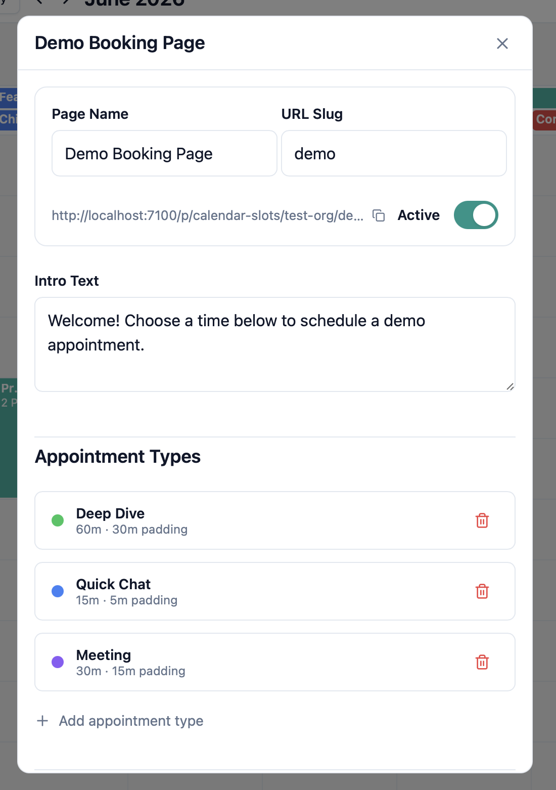
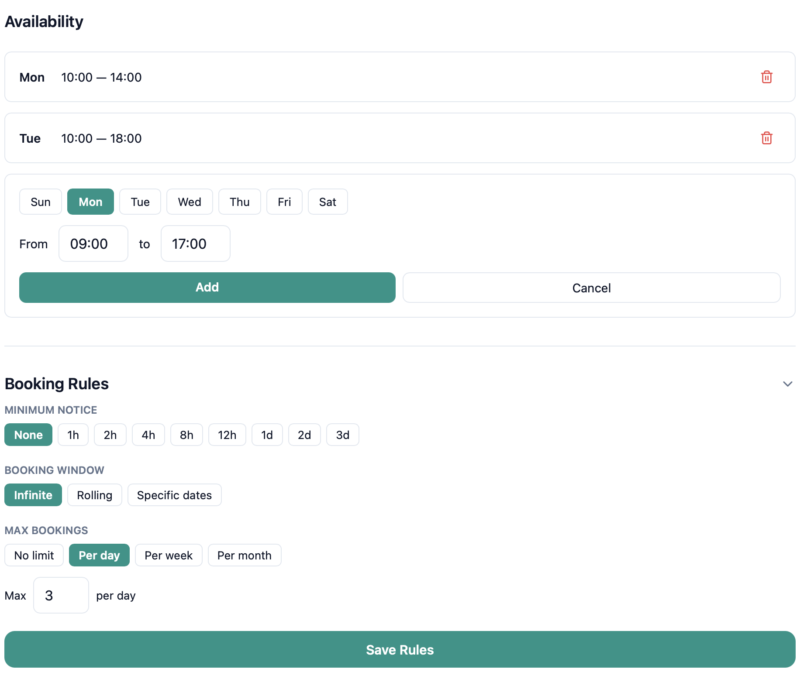
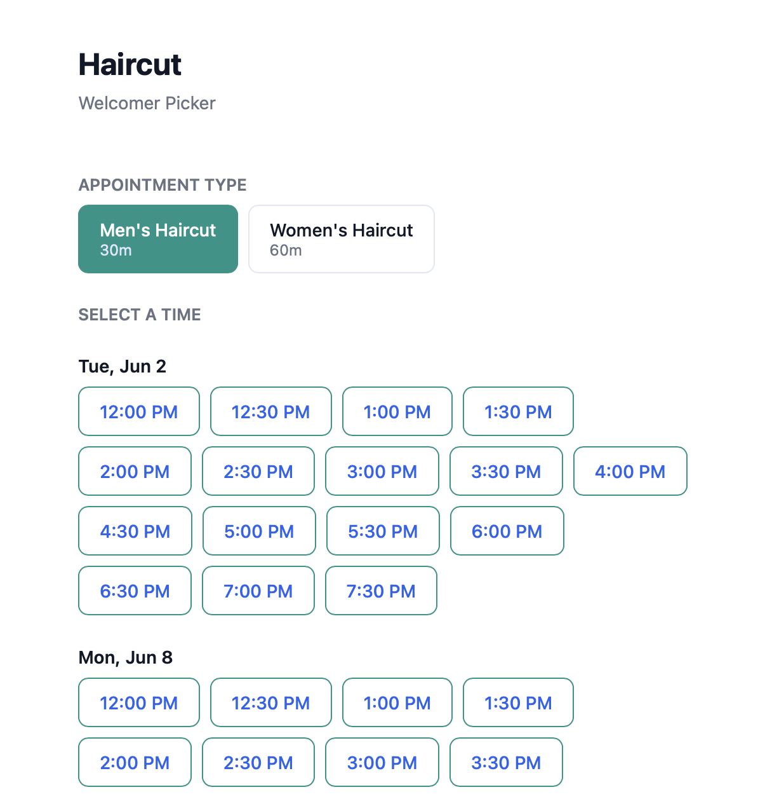

# calendar-slots

**https://github.com/stefnnn/tinycld-calendar-slots**

Let users book a slot on your calendar.

A feature package for the [tinycld](https://tinycld.org/) ecosystem. It lives in
its own git repo and is developed as a **workspace member** alongside the app
shell (`app`), `@tinycld/core` (its own standalone repo, cloned as a sibling —
not bundled), and the other feature packages.

## Features

**Booking pages** — create one or more public booking pages, each with a name, URL slug, and optional intro text. Each page gets a shareable link that works without login.



**Appointment types** — define multiple appointment types per page, each with its own duration and padding time. Padding is enforced symmetrically: a 30-minute slot with 15-minute padding requires 15 minutes of clear time both before and after on the owner's calendar.



**Availability windows & booking rules** — set per-day availability windows (e.g. Mon 10:00–14:00, Tue 10:00–18:00). Booking rules let you configure:

- **Minimum notice** — how far in advance a slot must be booked (none, 1h, 2h, … 3d)
- **Booking window** — infinite, rolling N days, or a specific date range
- **Max bookings** — cap the number of bookings per day, week, or month



**Public booking page** — guests visit the page, pick an appointment type, select a time slot, enter their name and email, and confirm. The slot is checked against the owner's existing calendar events in real time; only genuinely free slots are shown. On confirmation, a calendar event is created on the owner's calendar with the guest added.



## Installation

Clone this repo as a member of your tinycld workspace, then reinstall at the workspace root so the generator picks it up:

```sh
cd ~/code/tinycld
git clone git@github.com:stefnnn/tinycld-calendar-slots.git
pnpm install          # re-links members and re-runs the generator
```

Or bootstrap a fresh workspace with this package included from the start:

```sh
npx @tinycld/bootstrap@latest --tooling --with calendar-slots
pnpm install
cd app && pnpm run dev
```

To remove the package, delete its directory and run `pnpm install` again at the workspace root.

## Development

The package is one member of a tinycld workspace. To work on it you need a
workspace root containing at least `app`, `core`, and this package as siblings,
linked by a single `pnpm install` at the root.

```sh
# In a fresh workspace directory, clone this package into a member slot…
git clone git@github.com:stefnnn/tinycld-calendar-slots.git

# …then pull in the rest of the workspace tooling (app + core + the root
# package.json / lockfile). bootstrap --tooling skips dirs that already exist.
npx @tinycld/bootstrap@latest --tooling

# Link every member with one install at the WORKSPACE ROOT (never inside a
# member — siblings have no node_modules of their own; deps hoist to the root).
pnpm install

# Run the full stack (Expo + PocketBase, single-port dev proxy) from the app.
cd app
pnpm run dev
```

## Checks

All checks run **scoped to this member** through `tinycld-pkg`, which reuses the
app shell's biome config, tsconfig base, and vitest/playwright configs (so
`@tinycld/core/*`, uniwind augments, and PocketBase types all resolve):

```sh
cd calendar-slots
pnpm exec tinycld-pkg check       # biome + typecheck
pnpm exec tinycld-pkg test        # vitest unit tests
pnpm exec tinycld-pkg test:e2e    # playwright e2e specs (full preset only — packages with screens)
```

There is no `biome.json` in this repo — biome lives only in the app shell and
`tinycld-pkg` points it at this member's source.

## CI

`.github/workflows/ci.yml` runs typecheck, unit tests, and e2e on every push to
`main` and every PR. It checks out `tinycld/workspace` as the job root, drops
this PR's code into its member slot, assembles `app` + `core` via
`@tinycld/bootstrap --tooling`, installs at the workspace root, and runs
`tinycld-pkg check` / `tinycld-pkg test:e2e` — exactly what a developer runs
locally.

## Package anatomy

- `manifest.ts` — the single source of truth for this package's capabilities
- `package.json` — name, exports map, `tinycld-pkg` scripts, peer deps
- `tsconfig.json` — extends the app shell's package tsconfig base
- `vitest.config.ts` (and `playwright.config.ts` — full preset only) — thin configs spreading the app's
- `tinycld/calendar-slots/` — the package's TypeScript surface (screens, collections, …)
- `tests/` — vitest unit tests (and Playwright e2e specs — full preset only)
